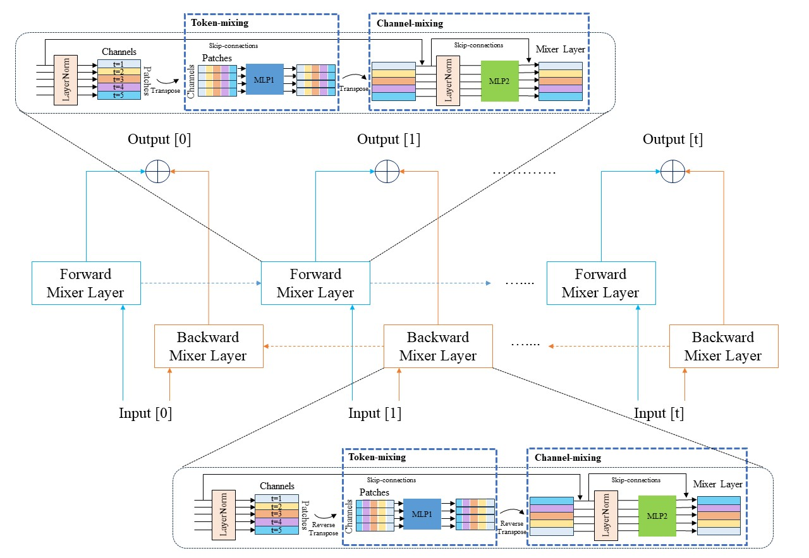

## With EEG online interaction EMPathy (WEE-EMP)


- **Participants**: 68 participants forming 34 pairs (male-male and female-female combinations)
- **Interaction Format**: Unscripted online video conversations with keyword prompts
- **Session Structure**: 
  - Four 10-minute conversation sessions (2-min preparation + 8-min conversation)
  - Participants alternating between talker and listener roles
  - Topics covering both positive and negative experiences
 
The dataset encompasses four primary modalities and features extracting code is provided:
1. **Visual**: 
 - Facial features (FaceNet512, Facial Emotion Recognition)
 - Pose (head nods, gestures, movements)
 - Gaze direction and pupil positions

2. **Audio**: 
   - HuBERT features
   - Wav2Vec2.0 features
   - Speaker-separated audio (talker/listener)

3. **Text**: 
   - Automatic Speech Recognition (ASR) transcriptions
   - DeBERTa-v3-xsmall embeddings (384 dimensions)

4. **Bio-signals**:
   - Electrodermal Activity (EDA)
   - Blood Volume Pulse (BVP)
   - Temperature (TEMP)
   - Metabolic Equivalent of Task (MET)

5. **EEG**:
   - 5-channel brain signals (AF3, T7, Pz, T8, AF4)
   - Collected via Emotiv Insight wireless headset
   - Preprocessed with AWICA (Adaptive Wavelet-ICA)
  
## Dataset Access
To request access to the WEE-EMP dataset, please send an email to **218354@jnu.ac.kr** with the following:

Subject: "WEE-EMP Dataset Access Request"
Attach **EULA-WEE-EMP.pdf** describing your research purpose and how you plan to use the dataset
Include your affiliation and contact information

All requests will be reviewed, and access will be granted for academic and research purposes in accordance with our data usage policy.


## Empathy Measurement

The dataset provides two types of empathy measurements:

1. **Formula-based empathy level**:

   $$E_L = W_e \times (N_I - |I_t - I_l|)$$
   
   Where:
   - $E_L$: Empathy level
   - $W_e$: Weight assigned to the emotion (0.2, 0.5, or 1.0)
   - $N_I$: Intensity range
   - $I_t$, $I_l$: Intensity of talker's and listener's emotions

2. **Talker Self-reported Empathy**
   - Question: "How much did your conversation partner empathize with you?"
   - 7-point Likert scale (strongly disagree to strongly agree)
   - Reflects talker's perception of received empathy

3. **Listener Self-reported Empathy**
   - Question: "How much did you empathize with your conversation partner?"
   - 7-point Likert scale (strongly disagree to strongly agree)
   - Reflects listener's intention to provide empathy


  
## Baseline Model Architecture


The LoMo-E (Loss-aware Modality selection for multi-modal Empathy estimation) framework consists of three main components:

### 1. Modality-Specific Transformer Encoders
  - Separate transformer encoders for each of the five modalities
  - Captures temporal dependencies within each modality

### 2. Bi-directional MLP-Mixer (Bi-Mixer)
We use the Bi-directional MLP-Mixer (Bi-Mixer) as a training module. The model handles multi-modal data by simultaneously processing forward and reverse contextual information. This approach captures the bidirectional nature of real-time interactions, improving empathy prediction accuracy.



### 3. Loss-aware Modality Selection (LoMo-E)
Dynamically selects the most reliable modality per sample based on prediction loss:

$$L_m^{(i)} = \text{CCE}(y^{(i)}, P_m^{(i)}) \cdot w_{c^{(i)}}$$

$$m_i^* = \arg\min_{m \in \mathcal{M}} L_m^{(i)}$$

Where:
- $L_m^{(i)}$: Weighted cross-entropy loss for modality $m$ and sample $i$
- $\text{CCE}$: Categorical Cross-Entropy loss function
- $y^{(i)}$: Ground truth label for sample $i$
- $P_m^{(i)}$: Predicted probability distribution for modality $m$ and sample $i$
- $w_{c^{(i)}}$: Class weight for the true class $c^{(i)}$ of sample $i$
- $m_i^*$: Selected modality for sample $i$ (the one with minimum loss)
- $\mathcal{M} = \{\text{visual, audio, text, bio, EEG}\}$: Set of all available modalities


## Installation

Install dependencies using the provided `requirements.txt` file: 

```python
pip install -r requirements.txt
```

## Citation
TBA


## Acknowledgments
TBA


